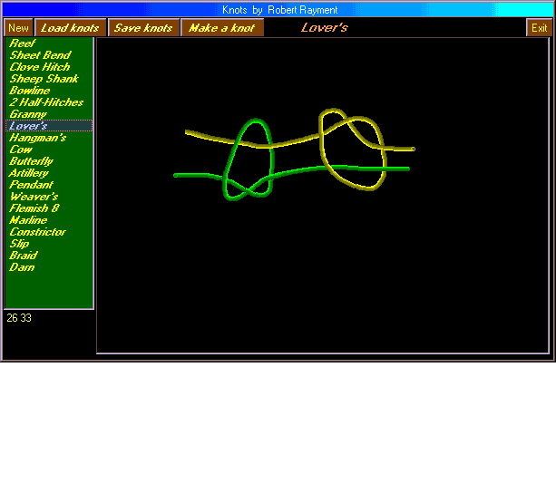



## Knots

### Description

Knots by Robert Rayment. Load knots, Save knots (*.knt files), Make a knot (colored cursor, + hairs, grid). Examples KNOTS.knt (20 knots drawn using this prog) & Hello.knt included. See also KnotsInfo.txt. Zip 21KB, Win98.
 
### More Info
 
Just run

Knot pictures

             |
---                |---
**Submitted On**   |2002-03-27 18:09:34
**By**             |[Robert Rayment](https://github.com/Planet-Source-Code/PSCIndex/blob/master/ByAuthor/robert-rayment.md)
**Level**          |Intermediate
**User Rating**    |4.8 (100 globes from 21 users)
**Compatibility**  |VB 6\.0
**Category**       |[Graphics](https://github.com/Planet-Source-Code/PSCIndex/blob/master/ByCategory/graphics__1-46.md)
**World**          |[Visual Basic](https://github.com/Planet-Source-Code/PSCIndex/blob/master/ByWorld/visual-basic.md)
**Archive File**   |[Knots659143272002\.zip](https://github.com/Planet-Source-Code/robert-rayment-knots__1-33111/archive/master.zip)

### API Declarations

APIs for timing and colored cursor

